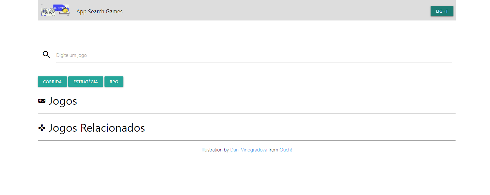
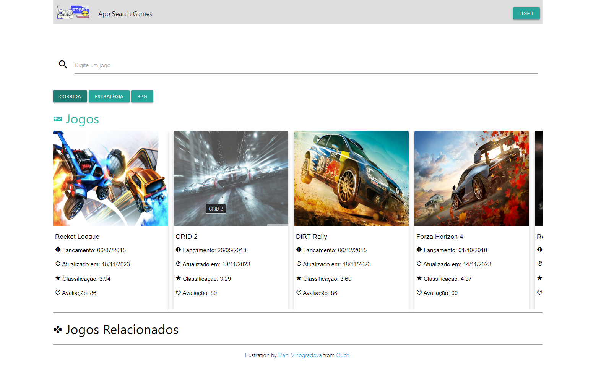
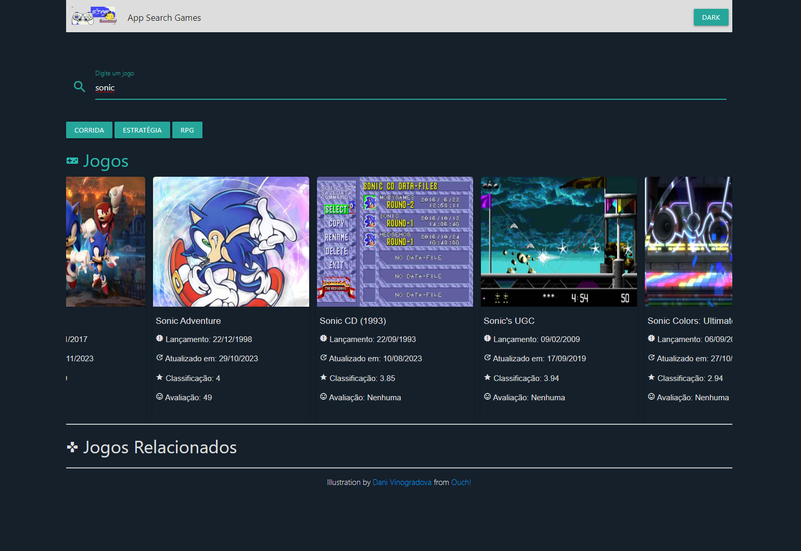
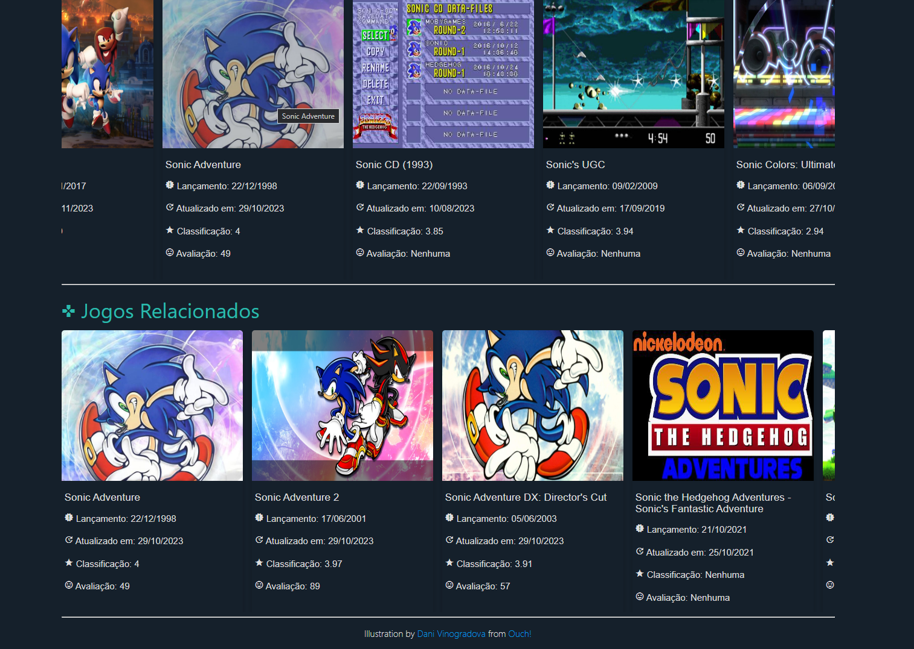

# games_the_search

## Descrição do projeto
A aplicação foi desenvolvida fazendo uso da função nativa fetch API do JavaScript. Essa função permite que, por meio de uma URL, seja feita uma requisição HTTP à API de jogos do site rawg.io, resultando em uma promise de retorno. Assim, quando os recursos estiverem prontos, eles são exibidos na tela. Em termos simples, ao efetuar uma busca por um jogo no campo de pesquisa, a aplicação retorna uma lista de jogos. Ao clicar em um deles, são exibidos os jogos relacionados.

## Screenshots

## Executar aplicação
Primeiro clonar o projeto com o comando `git clone <caminho-projeto>`

Acessar a pasta principal do projeto `./src` e abrir o arquivo `index.html` para a aplicação ser aberta em algum
navegador padrão

## Tecnologias
Javascript,
HTML,
CSS,
API rawg.io