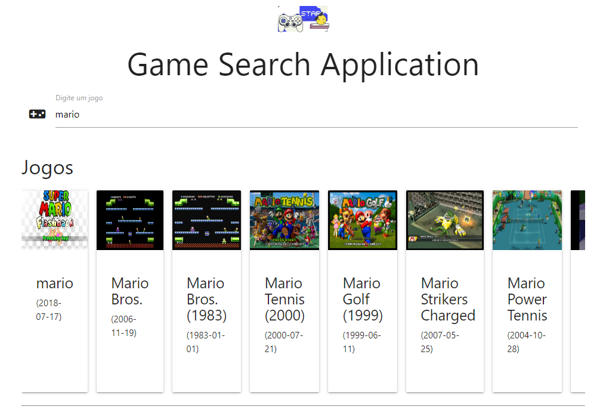
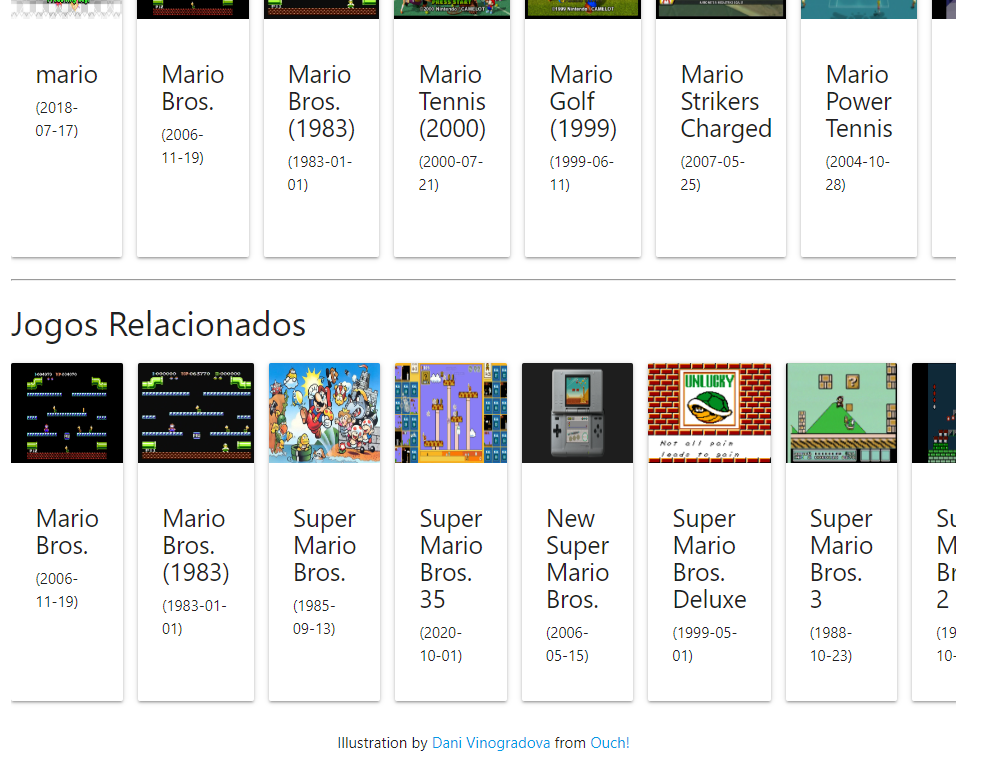

# games_the_search

## Descrição do projeto
A aplicação foi desenvolvida utilizando a função nativa fetch API do javascript, que por meio de uma URL faço uma requisição HTTP a API de jogos do site rawg.io, e obtenho uma promise de retorno, pois quando os recursos estiverem prontos, serem exibidos na tela. Em outras palavras, ao buscar por um jogo no campo de pesquisa,
retornar uma lista de jogos, que ao clicar em algum, exibir os jogos relacionados.

  
  

## Executar aplicação
Primeiro clonar o projeto com o comando `git clone <caminho-projeto>`

Acessar a pasta principal do projeto `./src` e abrir o arquivo `index.html` para a aplicação ser aberta em algum
navegador padrão

## Tecnologias
Javascript,
HTML,
CSS,
API rawg.io